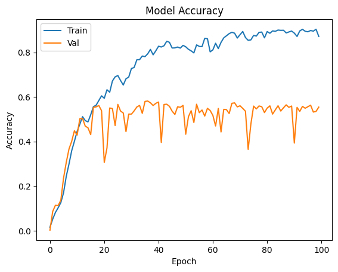
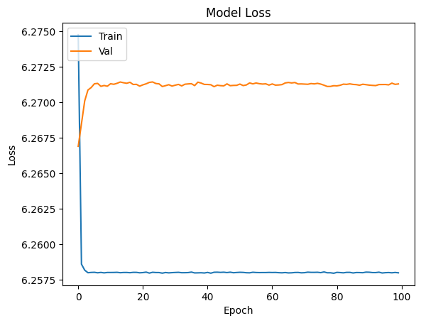
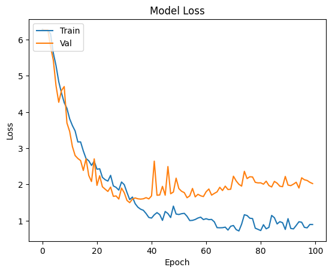

# Introduction
The "Bird Classification with AI/ML Project," led by Joseph Waldron, Gabriel Serrano, and Hashir Mohyuddin, aims to leverage Artificial Intelligence (AI) and Machine Learning (ML) for the challenging yet intriguing task of bird species classification. It utilizes two extensive datasets: the '100 Bird Species' (100-BS) comprising 525 species and 89,885 images, and the '200 Bird Species' (200-BS) set, featuring 200 species and 11,788 segmented images. This project aims to develop a robust ML tool useful in real-world scenarios, such as aiding amateur bird spotters and those searching for rare species.
Both datasets come preprocessed, and divided into training and testing subsets by species. Our focus is on training the models and evaluating various performance metrics. We plan to use PyTorch, TensorFlow, and MXNet libraries for training our datasets. The 200-BS, with its segmented masks, provides a unique opportunity to train models with and without these masks to determine if segmented data yields a statistically significant difference. The performance metrics under consideration include accuracy, precision, recall, training time, and classification time.
An important aspect of this project is the development of a user-friendly web application for public use. This platform will enable users to upload images and obtain real-time species classification results from all models, along with a simplified average result. If time permits, we also plan to include classification capabilities from videos.
This project exemplifies the innovative use of AI and ML in the realms of biodiversity and species identification, seeking to make a substantial contribution to both ornithology and technological fields.
# Flask application
The application is currently set up as a Flask application which uses the Python programming language as the backend of the web application. Using static templates, Flask renders web pages and easily handles REST API calls. Furthermore, using Flask allows us to directly make inferences from our trained machine learning models due to the Python backend.
The front end is currently a basic implementation of a form which allows the user to upload the image they want to classify, choose which model infrastructure they want to use, and classify the input image based on their selected model infrastructure.

# Libraries
As we mentioned before, we are using the TensorFlow, PyTorch, and MXNet libraries. With these, each of the following models will be trained: 
* Resnet50: A convolutional neural network that is 50 layers deep. It is trained on more than a million images from the ImageNet database.
* VGG16: A convolutional neural network that is 16 layers deep. It is trained on more than a million images from the ImageNet database. The results for 100 epochs are shown below: 
* InceptionV3: A convolutional neural network that is 48 layers deep. It is trained on more than a million images from the ImageNet database.

## Tensorflow
* Resnet50

Accuracy:  0.588190495967865
Loss: 4.657804489135742
* VGG16

Accuracy: 0.0019047618843615055 
Loss: 6.271306037902832

We believe the low accuracy score is due to this CNN not having enough layers for the 525 classes in our dataset.

* InceptionV3

Accuracy: 0.6925714015960693
Loss: 1.7439324855804443
Currently, this is the best model trained thus far.
PyTorch & MXNet
Still working/troubleshooting to obtain the results for these models.
