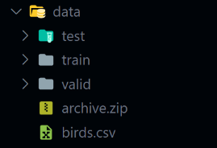
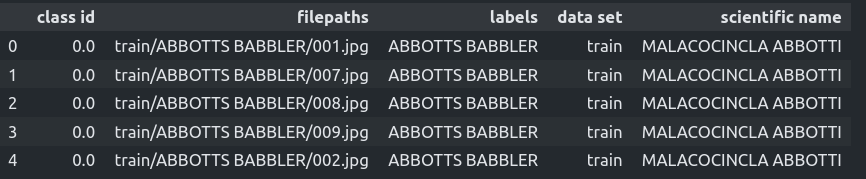
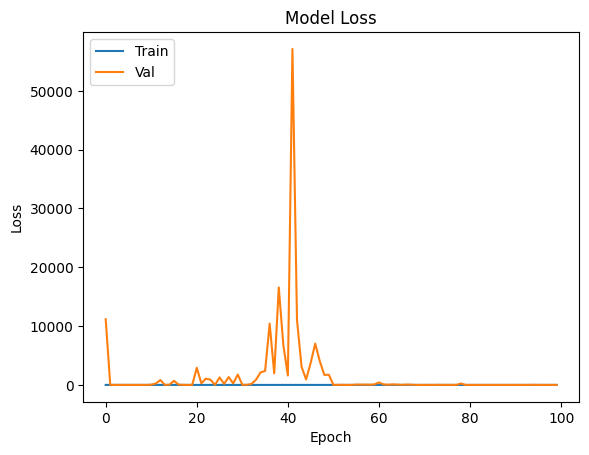
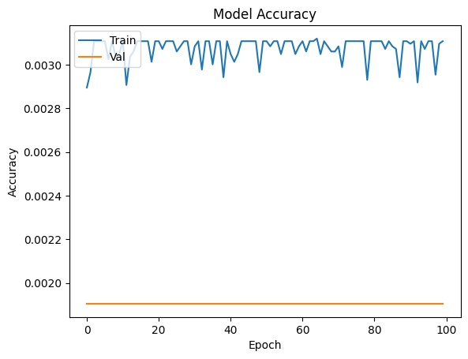
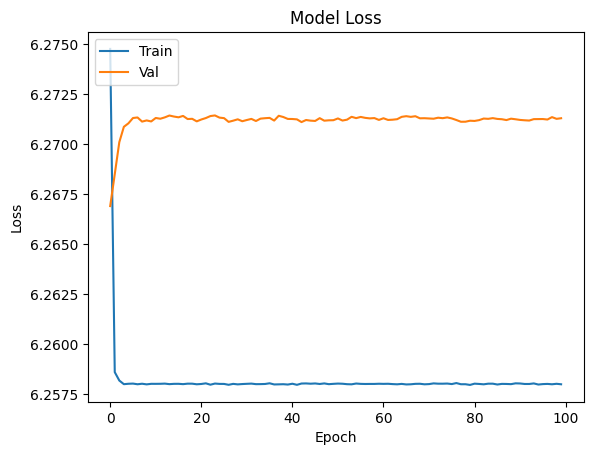
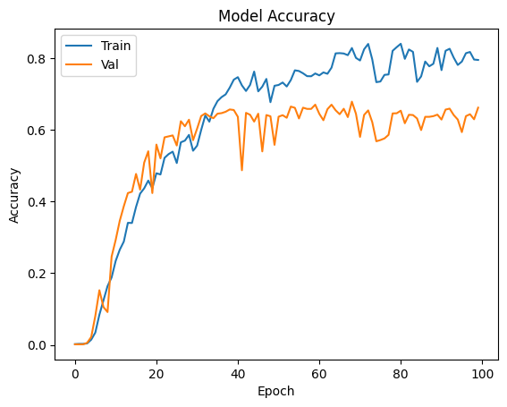
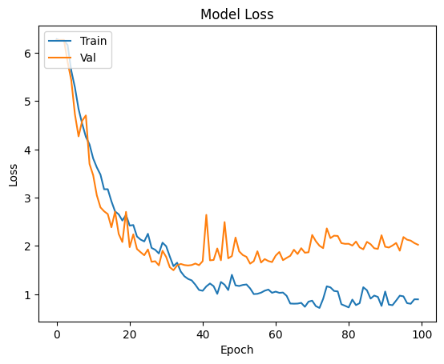

[Google Drive Link]()

So far the team has completed a number of tasks such as creating a repository, writing a project proposal, and creating a basic Flask application. The team has also found a dataset for the project and has begun to train a model with.

# Flask application

//TODO: Gabe add details on the Flask app

# Creating a Repository

The first step in the project was to create a repository. The repository was created on GitHub and is linked [here](https://github.com/josephWaldron/AI-ML-Project) The repository was then cloned to the local machine of each team member to allow for easy collaboration.

# Dataset choice and preprocessing

We have 2 datasets we might use for this project

1. [100 Bird Species Dataset](https://www.kaggle.com/datasets/gpiosenka/100-bird-species): 525 species, 89,885 total images.
2. [200 Bird Species](https://www.kaggle.com/datasets/veeralakrishna/200-bird-species-with-11788-images): 200 species, 11,788 total images (segmented)

We have started work with the 100 bird species dataset with 525 classes and 89,885 images. The steps taken to preprocess the data are as follows:

1. Download the dataset from Kaggle
2. Create a directory for the dataset on the training machine called `data` place the dataset in this directory and unzip it (it is gitingnored from the repo to not take up space)
3. once the data is unziped the folder structure is as follows:

4. To read all of the data into the program we use the following code:

```python
import pandas as pd
import os
bird_df = pd.read_csv("../data/birds.csv")
```
4. The head of the dataframe looks like this:


5. Next step is to load the images into the program.

```python
dir_train = "../data/train/"
dir_test = "../data/test/"
dir_v = "../data/valid/"
classes = os.listdir(dir_train)
n_classes = len(classes)
print("Total classes: ", n_classes)
```
Total classes:  525

6. Then we create the train loaders for tensor flow

```python
train_image_generator = ImageDataGenerator(rescale=1./255)
test_image_generator = ImageDataGenerator(rescale=1./255)
valid_image_generator = ImageDataGenerator(rescale=1./255)

#set up generators
batch_size = 16
img_height = 224
img_width = 224
channels = 3

train_data = train_image_generator.flow_from_directory(batch_size=batch_size,
                                                              directory=dir_train,
                                                              shuffle=True,
                                                              target_size=(img_height, img_width),
                                                              class_mode='categorical')

test_data = test_image_generator.flow_from_directory(batch_size=batch_size,
                                                                directory=dir_test,
                                                                shuffle=False,
                                                                target_size=(img_height, img_width),
                                                                class_mode='categorical')

val_data = valid_image_generator.flow_from_directory(batch_size=batch_size,
                                                                directory=dir_v,
                                                                shuffle=False,
                                                                target_size=(img_height, img_width),
                                                                class_mode='categorical')
```
ImageDataGenerator(rescale=1./255): The rescale=1./255 parameter is used to rescale the pixel values of images from a range of 0-255 to 0-1. This is a common practice in image processing as it helps in normalizing the data and speeds up convergence during training.
This will get up the images to be used in a model.

# Creating models

### Resnet50
The first model we tried is Resnet50. Resnet50 is a convolutional neural network that is 50 layers deep. It is trained on more than a million images from the ImageNet database. The results for 100 epochs are shown below:


With a final result on the test dataset:
Accuracy:  0.588190495967865
Loss:  4.657804489135742

### VGG16
The second model we tried is VGG16. VGG16 is a convolutional neural network that is 16 layers deep. It is trained on more than a million images from the ImageNet database. The results for 100 epochs are shown below:


With a final result on the test dataset:
Accuracy:  0.0019047618843615055
Loss:  6.271306037902832
(we think that this cnn does not have enough layers for the 525 classes in out dataset)
### InceptionV3
The third model we tried is InceptionV3. InceptionV3 is a convolutional neural network that is 48 layers deep. It is trained on more than a million images from the ImageNet database. The results for 100 epochs are shown below:


With a final result on the test dataset:
Accuracy:  0.6925714015960693
Loss:  1.7439324855804443
This is the best model we have trained so far

## Plans for the future
We plan to explore more models to see if we can get better results. We will also fine tune the InceptionV3 model to see if we can get the accuracy higher. We will also start working on the web application to display our results.